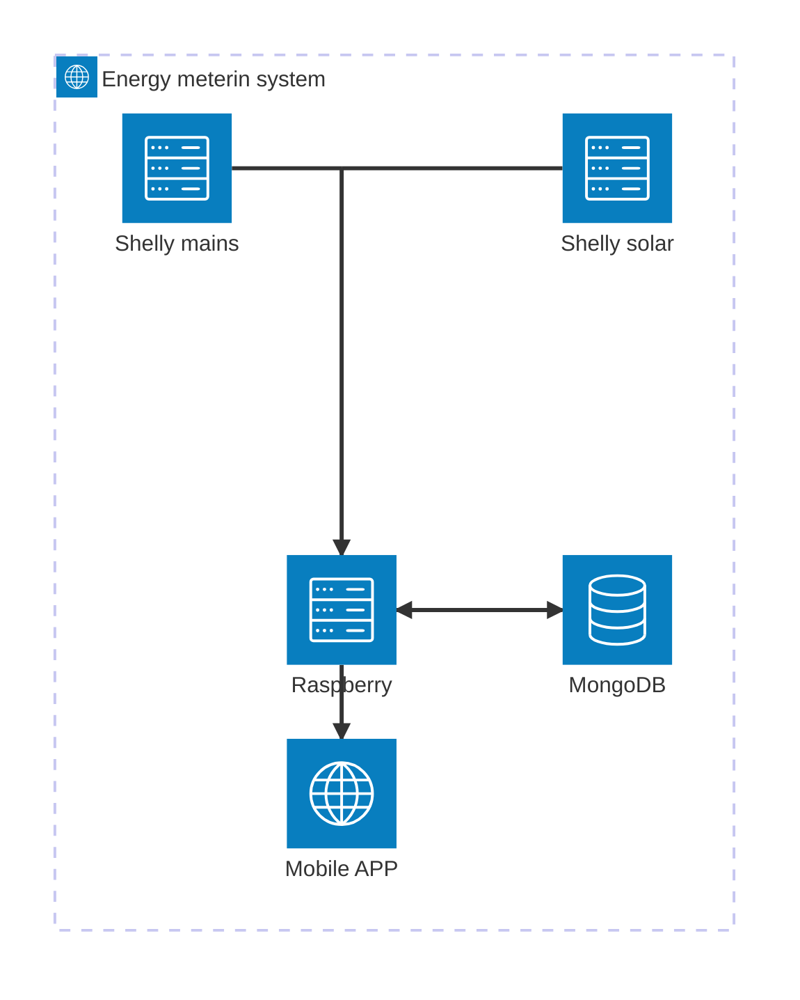

# Energy metering for smart home
## Project goal
The project will implement a mobile application to visualise energy consumption (from mains) and energy production (from solar power station). The mobile application will provide views for the amount instantaneous power consumption and generation as well as views for historical data on energy consumption and production.

The goal of the project is to implement a node.js/express server on RaspberryPI to read regularly on short intervals power and energy data from two Shelly pro 3EM energy meters. The other Shelly pro 3EM (Shelly mains) is connected to the 3-phase mains and the other Shelly pro 3EM (Shelly solar) is connected to the 3-phase solar power station. The server will store the energy data read from the two Shellys in a free hosted MongoDB database. The server will provide a REST API for reading current, daily, weekly, monthly and yearly power and energy data. The current data is reported as power (W, watts) and the daily, weekly, monthly and yearly energy are reported as energy (Wh, watt hours).

Instantaneous/current data is read by the server from the Shellys and reported through the REST API interface. Daily/weekyl/monthly/yearly data are read from the MongoDB server and reported through the REST API interface

## work hour log
|date|time|activity|Next|
|:----:|:----:|:----:|:----:|
|5.4.|1|Shelly pro 3EM received: need to order electrician to install. RaspberryPI not received yet|Start SW project|
|6.4.|3|Start the project: create Github repo, draw an architecture diagram, write project description|Study Shelly API, plan data schemas|
|20.4.|1|RaspberryPI has not arrived yet, nor has the electrician installed the Shellys. Time spent for planning the connection of the Shellys into the house main switchboard (installation will be done by an electrician)|Study Shelly API, plan data schemas|
|21.4.|2|Study MongoDB Time Series Collection. It is introduced in version 5.0 for storing time series data, what my data is natively - a lot of data with a timestamp all with same/similar metadata|Study Shelly API, plan data schemas|

