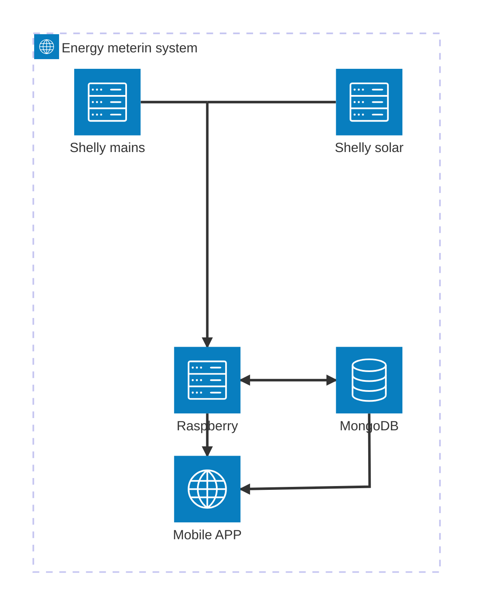

# Energy metering for smart home
## Project goal
The project will implement a mobile application to visualise energy flows: consumption / returned from mains and production from solar power station. The mobile application will provide views for the amount of instantaneous energy flows as well as views for historical energy flows.

The goal of the project is two-fold: first to implement a node.js/express server on RaspberryPI to read regularly power and energy data from two Shelly pro 3EM energy meters. The other Shelly pro 3EM (Shelly mains) is connected to the 3-phase mains (i.e. grid) and the other Shelly pro 3EM (Shelly solar) is connected to the 3-phase solar power station (i.e. photovoltaic). The server will implement basic CRUD operations to manage the energy readings from the two Shellys in a free hosted MongoDB database. Additionally, the server will provide a basic REST API for reading current, daily, weekly, monthly and yearly power and energy data. The current data is reported as maximum power (W, watts) and the daily, weekly, monthly and yearly energy are reported as energy (Wh, watt hours). Instantaneous/current data is read by the server from local storage (e.g. from daily data) and reported through the REST API interface. Daily/weekly/monthly/yearly data are read from the MongoDB server and reported through the REST API interface. 

The second objective is to create a mobile application with React Native and EXPO framework to request and present hourly/daily/weekly/monthly/yearly energy flows. The aim is to provide graphical visualization both to current power and historical energy flows. Since the energy meter system will operate inside a local network which is not exposed externally (no public IP address), the mobile application will use the free hosted MongoDB database directly to fetch historical data. Presentation of current data is only possible within local network.

Insides of the fuse cabinet and planned locations of energy meters and related circuit breakers.

Cover of the fuse cabinet after succesfull installation.

## work hour log
|date|time|activity|Next|
|:----:|:----:|:----:|:----:|
|5.4.|1|Shelly pro 3EM received: need to order electrician to install. RaspberryPI not received yet|Start SW project|
|6.4.|3|Start the project: create Github repo, draw an architecture diagram, write project description|Study Shelly API, plan data schemas|
|20.4.|1|RaspberryPI has not arrived yet, nor has the electrician installed the Shellys. Time spent for planning the connection of the Shellys into the house main switchboard (installation will be done by an electrician)|Study Shelly API, plan data schemas|
|21.4.|2|Study MongoDB Time Series Collection. It is introduced in version 5.0 for storing time series data, what my data is natively - a lot of data with a timestamp all with same/similar metadata|Study Shelly API, plan data schemas|
|29.4.|1|Both Shellys and automatic circuit breakers received from Amazon.de. The estimated delivery for RaspberryPI is 7.5. Time was spent studying the needed electric componenta to the main electroc circuit/switchboard. Electrocian ordered.|Start with SW finally...|
|6.5.|3|Finally received RaspberryPI from Amazon.de. Setting-up, installing necessary SW and cloning the Github repo|The day after tomorrow, an electirician will install the Shellys and the coding project can finally start|
|8.5.|3|Two Shellys installed and connected to local WiFi network. Shellys detect and measure the current by using a transformer wrapped around the wire i.e. by magnetic induction. I had two out of six transformers installed in wrong direction... Struggled a bit with starting coding... where to start... what to do first, but then I decided to start from scratch and see if I can get data in 60s intervals read from the Shellys. Had to learn all about UNIX timestamps.|Next task is to build structure for the SW project and start implementation. First task is to get energy data read from both meters (Shellys) in 60s intervals, stored those locally and the save them to Atlas MongoDB by the end of the day.|
|9-11.5.|12|A lot of updates: actual and returned energies calculated correctly. Shelly's do not report negative energy, but returned energy as positive. Took a while to figure out... Server application structure adjustment and code refactoring. Now data is collected once per minute and stored locally as mongoose Schema objects. MongoDB time-series collection creation in the beginning of the application (in case it has not been created already)|Next task is to store once per day the time-series data into Atlas MongoDB|
|12.5.|4|More implementation: helper functions to calculate total consumptio and net energy flow from solar generated energy, mains bought and sold energies. Created function to write data to mongoDB.|Implement simple functions to read energy readings from mongoDB|
|13.5.|5|Implement a function to read values from a time range betwen start and end timestamps. Implement first routes /energy/ to handle GET messages (no MongoDB access yet). Implement basic middleware for request logging and wrong endpoint handling |Todo: GET routes and MongoDB READ for daily data, implement aggregation routines to aggregate the minute based data to desired granularity; GET route/READ for hourly data; GET route/READ for weekly; monthly, yearly data; Open and close MongoDB only when CRUD actions are done; Validate the READ data, are timestamp data missing? Re-fetch the missing. Do validation regularly or always when WRITING ?; implement logic to WRITE data immediately after the program has been stopped due to for instance ctrl-C|
|14.5.|2|Implemented a shutdown function to gracefully close after terminal break (ctrl-C etc.)|Todo: GET routes and MongoDB READ for daily data, implement aggregation routines to aggregate the minute based data to desired granularity; GET route/READ for hourly data; GET route/READ for weekly; monthly, yearly data; Open and close MongoDB only when CRUD actions are done; Validate the READ data, are timestamp data missing? Re-fetch the missing. Do validation regularly or always when WRITING ?|
|15.5.|3|Implement a function to convert local date to start timestamp and endtimestamp in UTC format. Create first incarnation of GET /energy/date/:date to fetch energy readings from that day, and return in response. Does not work yet though..|Todo: same as yesterday|
|16.5.|4|Studied MongoDB aggregation and implemented a function to aggregate hourly data from the one minute readings. This can be used for drawing barchart for daily (hourly) energy consumption. Implemented a GET /energy/hourly/:date to provide the hourly aggregated data.|Todo: GET route/READ for weekly; monthly, yearly data; Open and close MongoDB only when CRUD actions are done; Validate the READ data, are timestamp data missing? Re-fetch the missing. Do validation regularly or always when WRITING ?|
|18.5.|3|Studied working with UTC timestamps. I want to give a local date (yyyy-mm-dd) to GET requests, and convert the local date to UTC timestamps. Multiple trial and error rounds with Javascript Date-object... frustrating, but finally the getUtcRangeForLocalDate-function does what the name says |I need to implement functionality to check missing data reads. Logging is stopped and re-started every time the program is modified, any skipped data needs to fetched and stored|
|18.5.|2|Installed LUXON package and started to use DateTime function in determining the UTC time. This package should understand and handle daylight savings better. Remains to be seen. | Implement the "missed reading" catch-up functionality|
|21.5.|5|Started to implement functionality for detecting missing 1-minute readings and fetching and storing them separately. First version of functionality created, but not activated yet, as needs more thorough testing.|Finish the functionality for gap detection and fill-up. Then start to either implement first version of React Native application|